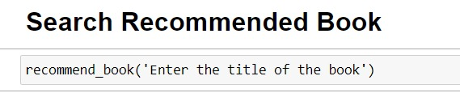
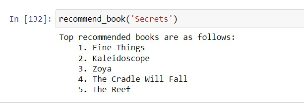

# book-recommender-system

This book recommender system is based on Collaborative Filtering. we tend to find similar users and recommend what similar users like. In this type of recommendation system, we don’t use the features of the item to recommend it, rather we classify the users into the clusters of similar types, and recommend each user according to the preference of its cluster.

This is how the Recommendation Function Look like:

these are recommended results😍😎

Steps to run this project and check it's functionality
- Clone this project
- open in jupyter notebook
- Go to the recommender function 
- search for recommendation 

That's all. ✅✅😍

